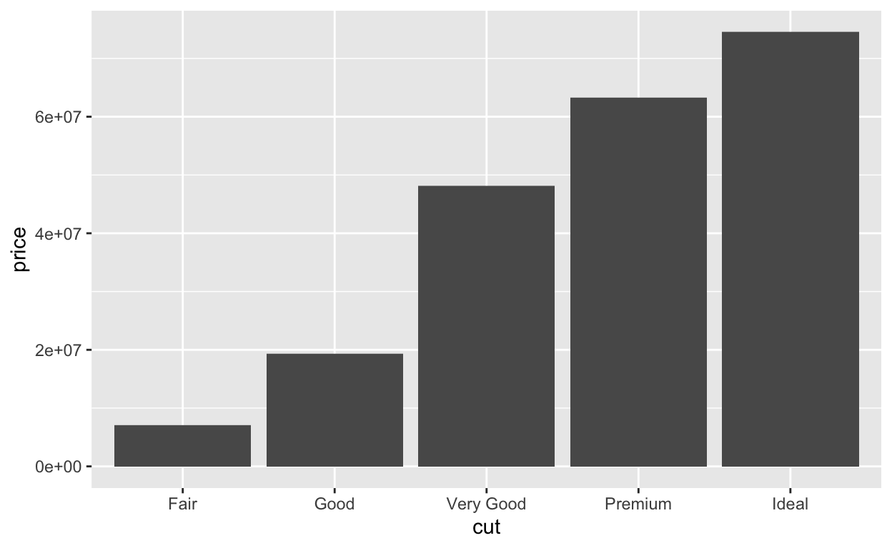

This is a very quick test run that I'm doing to see if I can push a new blog post using VS Code. 

<div class="layout-chunk" data-layout="l-body">


</div>


```{.r .distill-force-highlighting-css}
```
